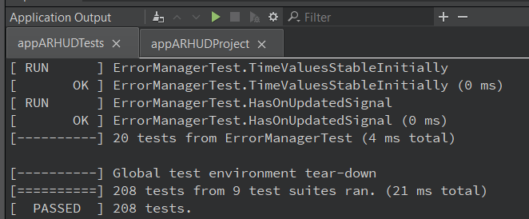
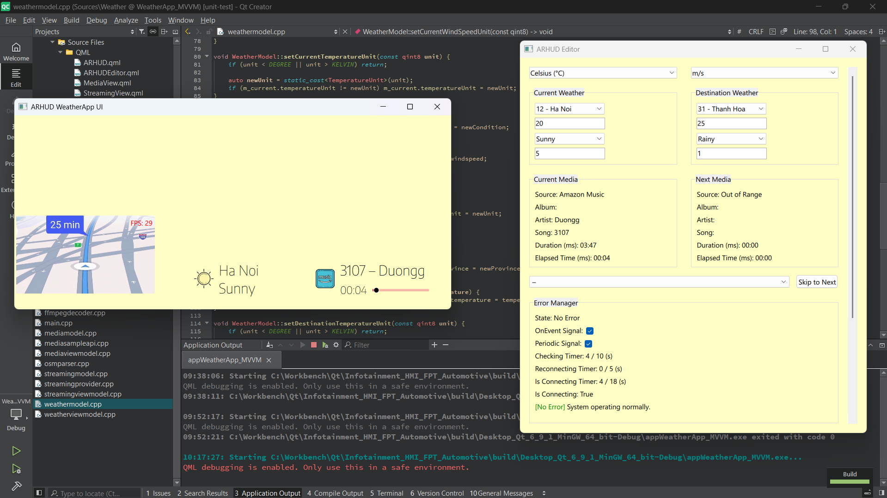
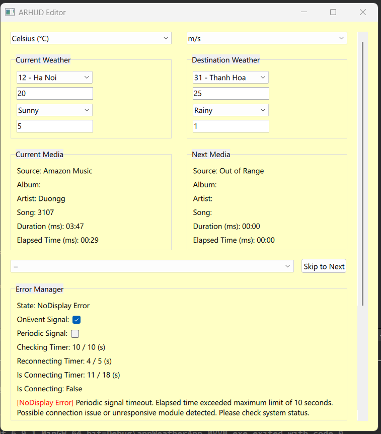
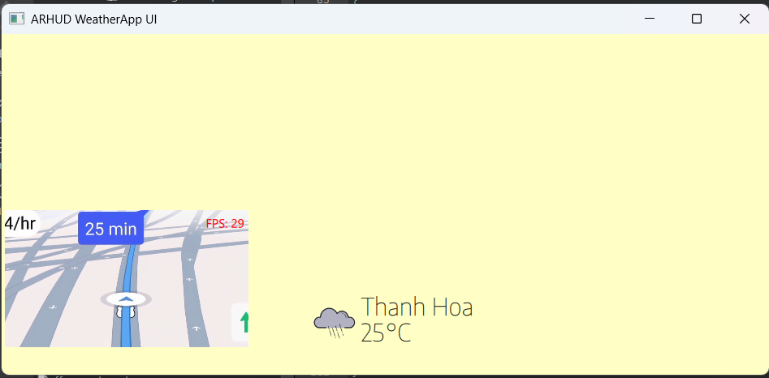
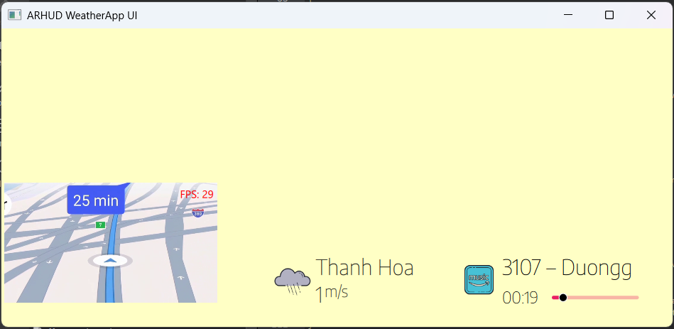
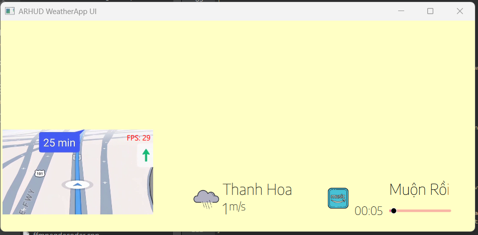
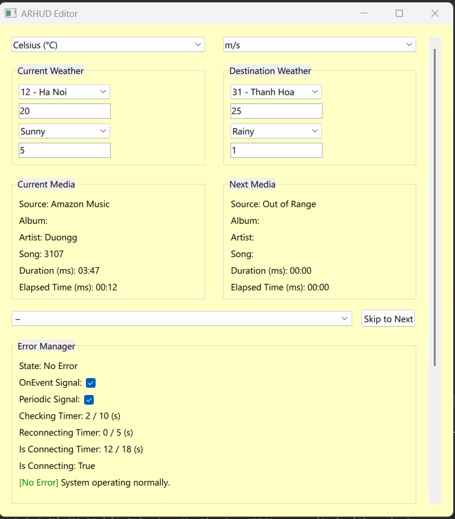

# WeatherApp_MVVM -  Automotive HMI, AR HUD & Qt Editor Prototype

This project simulates an **automotive HMI system** with **AR HUD features**, designed for windshield projection. It includes a fully custom **ImGUI-inspired editor** and is structured around real-world workflows from my collaboration with **FPT Automotive**.

* **Video:** [Automotive AR-HUD Demo](https://youtu.be/SjDzGrQi5eA)

---

## ✨ Purpose

- Practice with **automotive HUDs**, **AR interfaces**, and **HMI design**
- Prototype interactive systems: weather, media, and video streaming
- Write professional documents (SRS, SAD)
- Simulate customer-facing automotive development pipelines

---

## 🛠️ Tech Stack

- **Qt 6 / QML** -  Modern, cross-platform UI
- **C++** -  System logic and MVVM ViewModel
- **Qt SCXML** -  Reliable state control
- **Qt Resource System (qrc)** -  Embedded fonts and assets
- **MVVM Pattern** -  Separation of UI, logic, and data
- **FFmpeg** -  Video decoding and HUD streaming
- **Custom Editor** -  Real-time HUD adjustment, ImGUI-style, made with Qt Quick

---

## 🔧 Core Features

### 🌐 System Highlights
- AR-style HUD visuals for windshield simulation
- Real-time **HUD editor** for runtime layout/configuration
- Modular MVVM layout: `Media/`, `Weather/`, `Streaming/`, `Error/`, `3D/`
- State-driven logic with `ErrorManager` via SCXML
- Fully embedded build (assets via qrc)

### ☁️ Weather Panel
- Live display of **province**, **temperature**, **condition**, and **windspeed**
- Dual support: current & destination locations
- MVVM-based, SCXML-controlled dynamic state transitions

### 🎵 Media Panel
- Displays source, song title, and artist
- Editor integration for live data editing

### 📹 Streaming Panel
- **FFmpeg-based** decoding and display
- Simulates real-time AR HUD video stream
- C++-only decoding backend exposed to QML

---

## 📁 Folder Overview

```
├── Headers/           # C++ headers
├── Sources/           # C++ source files
│   ├── QML/           # QML UI & editor
├── Plugins/           # Third-party libraries (FFmpeg, GoogleTest)
│   ├── ffmpeg/
│   └── googletest/
├── Resources/         # Images, fonts, and assets
├── Demo/Images/       # Project screenshots
├── UnitTests/         # GTest-based unit tests
└── CMakeLists.txt     # Build config
```

---

## 📦 FFmpeg Setup

Streaming requires FFmpeg binaries (excluded from repo):

1. **Download Plugins**
   ➡️ [Google Drive: `Plugins/ffmpeg/`](https://drive.google.com/drive/folders/1A8O1zK8L6aH4mVjb2OzUNdu9SA5hp5Dg?usp=drive_link)

2. **Place in Folder**
   ```
   <project>/
   └── Plugins/
       └── ffmpeg/
           ├── bin/
           │   ├── avcodec-61.dll
           │   └── ...
           └── lib/
               ├── libavcodec.dll.a
               └── ...
   ```

3. *(Optional)* PowerShell automation:
   ```powershell
   Move-Item -Path "C:\Path\To\ffmpeg" -Destination ".\Plugins\ffmpeg"
   ```

---

## 🧪 Unit Test Coverage

This project includes **200+ unit tests** across weather, media, streaming, and error logic, implemented using **GoogleTest** (`Plugins/googletest`).

| UnitTest Summary |
|------------------|
|  |

---

## 🖼️ Screenshots

| Overview | EditorNoDisplay |
|----------|-----------------|
|  |  |

| HUDNoDisplay | HUDNoError |
|--------------|------------|
|  |  |

| HUDLongMusic | EditorNoError |
|--------------|----------------|
|  |  |

---

## 🚧 Note

This is a **technical prototype** focused on architecture and workflow simulation -  not visual polish or feature completeness.

---

## 😎 Why Custom Editor?

To maintain full control over the HUD with zero third-party UI dependencies. The editor is inspired by **ImGUI**, but fully implemented in **Qt Quick** to support real-time interaction and styling.

---

## 🙏 Acknowledgments

Created to expand my skills in automotive HMI, AR HUDs, and Qt-based architecture, inspired by my internship with **FPT Automotive**.
